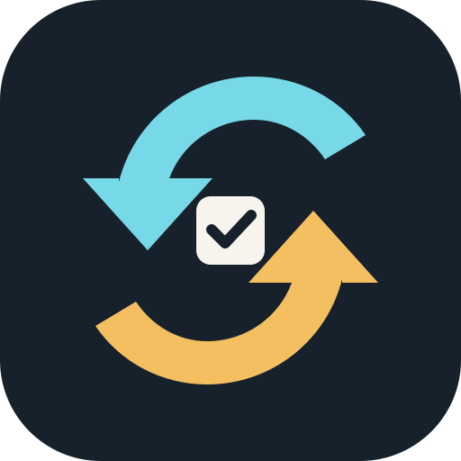

<p align="center">
  
</p>

<h1 align="center">Own The Change</h1>

<p align="center">
  AI가 바꾼 코드를 테스트 통과로 넘기지 않고, 내가 설명하고 고칠 수 있는 지식으로 남기는 로컬 우선 학습 도구
</p>

<p align="center">
  Claude Code · Codex CLI · 다른 에이전트 확장 가능 · 서버 없음 · API Key 없음
</p>

## 왜 필요한가

AI 코딩 에이전트는 많은 변경을 빠르게 만들 수 있습니다. 하지만 테스트가 통과했다는 사실만으로 사용자가 나중에 다음 질문에 답할 수 있다는 뜻은 아닙니다.

- 왜 이 방법을 골랐는가?
- 어느 파일과 동작에 영향이 있는가?
- 테스트가 놓친 위험은 무엇인가?
- 문제가 생기면 어디부터 고칠 것인가?

Own The Change는 코드 품질을 점수로 매기거나 PR을 승인하지 않습니다. 사용자가 실제 변경을 자기 말로 설명할 기회를 만들고, 부족한 부분만 짧게 보완한 뒤 Markdown으로 남깁니다.

## 한눈에 보는 흐름

```text
작업 전                         작업 후                         나중
Plan Check ──→ AI coding ──→ Change Debrief ──→ Understanding Record ──→ follow_up_at
예상·위험·테스트                실제 diff·테스트 근거            자기 말 설명·남은 위험           중요한 변경만 날짜 기록
```

1. `Plan Check`: 바뀔 파일, 위험, 필요한 테스트를 예상해 봅니다. 답하지 않아도 작업은 막지 않습니다.
2. `Change Debrief`: 실제 `git diff`와 실제 테스트 결과만 근거로 무엇·왜·영향·한계를 설명합니다.
3. `Understanding Check`: 위험도에 따라 최대 3개 질문으로 사용자의 설명을 듣습니다.
4. `Understanding Record`: 결과를 `docs/ai-understanding/YYYY-MM-DD/<task-id>.md`에 남깁니다.

## 핵심 안전 원칙

- 테스트 통과나 AI 자기평가만으로 `confirmed`를 쓰지 않습니다.
- 사용자가 답하지 않으면 `not_confirmed` 또는 `unknown`입니다.
- 실행 메타데이터를 신뢰할 수 없으면 `provider`, `model`, `turn`, `token`, `cost`는 `unknown`으로 남깁니다.
- 원본 코드, 환경 변수, 비밀값, 전체 터미널 로그를 외부로 보내지 않습니다.
- 자동 코드 수정, 자동 배포, 자동 병합, PR 승인, 이해도 점수는 범위 밖입니다.

공통 학습 규칙의 유일한 정본은 [이해 프로토콜](docs/protocol/understanding-protocol.md)입니다. Claude Code, Codex, 범용 어댑터는 이 문서를 참조하며 규칙을 복사하지 않습니다.

## 지원 범위

| 도구 | 제공 방식 | 명시 호출 |
| --- | --- | --- |
| Claude Code | 루트 plugin manifest, commands, skill, 선택형 Stop hook | `/own-plan-check`, `/own-change-debrief`, `/own-understanding-check` |
| Codex CLI | `.agents/skills/`와 `.codex-plugin/` | `$own-the-change` 또는 checkpoint 요청 |
| Cursor · Copilot | 공통 skill을 가리키는 발견 경로 | 도구의 skill 선택 화면 또는 자연어 요청 |
| 다른 에이전트 | 범용 안내 파일 | `adapters/generic/AGENT-INSTRUCTIONS.md` 제공 |

## 설치와 제거

### 공통 확인

```sh
cd /path/to/own-the-change
python3 -m unittest discover -s tests -v
python3 scripts/validate_record.py docs/ai-understanding/*/*.md
```

### Claude Code

프로젝트에서 먼저 시험할 때는 저장소 루트에서 실행합니다.

```sh
claude --plugin-dir .
```

세션 안에서 다음 command를 호출합니다.

```text
/own-plan-check
/own-change-debrief
/own-understanding-check
```

이 방식은 현재 세션에서만 불러오는 방식이므로 세션을 끝내면 별도 제거 작업이 필요 없습니다. 배포용 plugin 설치·제거는 Claude Code 버전에 따라 달라질 수 있으므로 [공식 Claude Code plugin 문서](https://code.claude.com/docs/en/plugins)를 확인하세요.

### Codex CLI

Codex는 저장소 루트의 `.agents/skills/own-the-change`을 자동으로 찾습니다. 이 경로는 공통 skill인 `skills/own-the-change/`을 가리키는 심볼릭 링크입니다. 따라서 이 저장소 안에서는 별도 설치가 필요 없습니다.

```sh
scripts/install-local.sh codex-project
```

사용자 범위 설치는 이 컴퓨터의 모든 저장소에서 보입니다.

```sh
scripts/install-local.sh codex-user
```

제거는 사용자 범위 설치에만 필요합니다.

```sh
scripts/install-local.sh remove-codex-user
```

Codex가 새 skill을 찾지 못하면 다시 시작합니다. 위치와 명시 호출 방식은 [공식 Codex Skills 문서](https://developers.openai.com/codex/skills/)를 따릅니다.

## 이해 기록 예시

```yaml
---
task_id: authorization-guard
date: 2026-09-09
understanding_status: needs_follow_up
risk_level: high
follow_up_at: 2026-09-10, 2026-09-16 — authorization 경계를 다시 설명
execution_metadata:
  provider: unknown
  model: unknown
  turn: unknown
  token: unknown
  cost: unknown
---
```

본문에는 작업 목표, 변경 파일, 테스트 근거, 핵심 설명, 사용자 답변, 이해 상태, 남은 위험, 다음 확인 항목이 들어갑니다. 새 기록은 [템플릿](templates/understanding-record.md)을 복사해 만든 뒤 검사합니다.

```sh
python3 scripts/validate_record.py docs/ai-understanding/YYYY-MM-DD/<task-id>.md
```

실제 예시는 [낮은 위험 변경](docs/examples/low-risk-change.md), [권한 변경](docs/examples/authentication-change.md), [데이터베이스 변경](docs/examples/database-change.md)에서 볼 수 있습니다.

## 저장소 구조

```text
.claude-plugin/  Claude Code plugin manifest와 local marketplace metadata
.codex-plugin/   Codex plugin manifest
.agents/skills/  Codex·Copilot 호환 프로젝트 범위 skill 링크
.cursor/skills/  Cursor 호환 프로젝트 범위 skill 링크
commands/        Claude Code 명시 command
hooks/           사용자가 답하지 않으면 상태를 바꾸지 않는 선택형 hook
skills/          모든 도구가 공유하는 단일 skill
adapters/       도구별 연결 방식 설명 (공통 규칙 복사 금지)
docs/protocol/   공통 학습 규칙과 기록 형식 정본
docs/research/   학습 원리, 논문 근거, 제품 적용 가설
docs/ai-understanding/  날짜별 이해 기록
templates/       기록 템플릿
scripts/         설치 도구와 결정론적 기록 검증기
tests/           검증기와 설치 구조 테스트
```

자세한 구조와 일부러 만들지 않은 기능은 [architecture.md](docs/architecture.md)에 있습니다.

## 연구 근거와 출력 형태

학습 설계는 능동 회상, 자기 설명, 점진적 도움 축소, 인지 부담 관리, 간격 복습, 구체적 피드백, 이해 착각 방지를 참고합니다. 논문 정보와 연구 사실·제품 적용 가설의 구분은 [학습 원리](docs/research/learning-principles.md)에 기록했습니다. 논문이 AI 코딩 환경의 효과를 보장한다는 뜻은 아닙니다.

긴 변경 설명을 행동으로 옮기기 쉽게 하려고 [i-have-adhd](https://github.com/ayghri/i-have-adhd)의 행동 우선, 작은 단계, 가시적 진행 원칙을 참고했습니다. Own The Change는 ADHD 진단이나 치료 기능이 아니며 해당 프로젝트의 코드나 문구를 복사하지 않습니다. 적용한 규칙은 [공통 이해 프로토콜](docs/protocol/understanding-protocol.md)의 `읽기 쉬운 출력 형태`에만 둡니다.

## 개인정보 보호

Own The Change에는 서버, 계정, 데이터베이스, 결제, 외부 SaaS가 없습니다. 별도의 API Key도 요구하지 않습니다. 사용자가 이미 로그인한 Claude Code 또는 Codex 환경을 그대로 사용합니다.

로컬 기록에는 학습에 필요한 변경 요약과 사용자의 답변만 적습니다. 비밀값과 전체 로그를 기록하지 마세요.

## 개발 상태

첫 버전은 실제로 쓸 수 있는 작은 범위를 우선합니다. 현재는 로컬 기록, 형식 검증, Claude Code·Codex 연결층, 중요한 변경의 날짜 기반 복습 후보를 제공합니다. 알림 발송, 자동 동기화, 이해 점수, 자동 수정 기능은 의도적으로 아직 만들지 않았습니다.

## 라이선스

[MIT](LICENSE)
