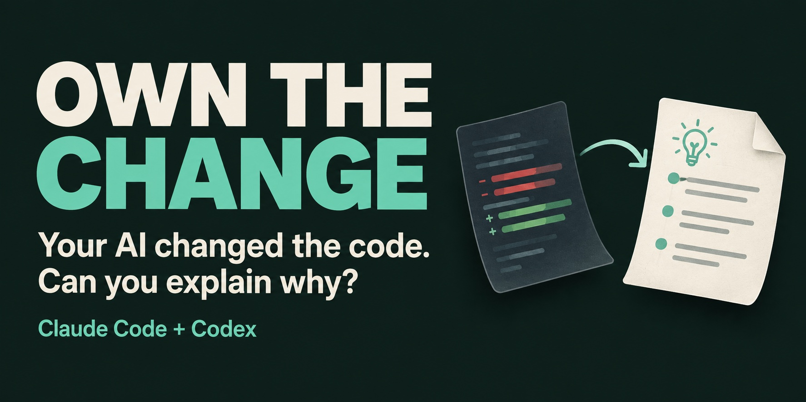

<h1 align="center">Own The Change</h1>



[](https://github.com/parkyountaek/own-the-change/actions/workflows/test.yml) [](LICENSE) [](CONTRIBUTORS.md#ai-development-assistance)

<p align="center">
  Claude Code - Codex CLI - local Markdown records - no server to run - no extra API key
</p>

Turn an AI-generated diff into an explanation you can use in a pull request or your next bug fix: what changed, why, what the tests missed, and where to look if it breaks.

Start with a **Change Debrief** after one coding task. Questions are optional; no score or approval gate.

[Install for Claude](#claude-code) · [Install for Codex](#codex-cli) · [45-second walkthrough](docs/demo.md) · [Update](docs/updating.md) · [Feedback](docs/launch/early-access.md) · [Share](docs/launch/media-kit.md)

<details>
<summary>See what a Change Debrief adds to a two-line diff</summary>

```diff
 def display_name(value):
-    return value.strip()
+    return " ".join(value.split())
```

> **An explanation worth keeping:** This also changes whitespace *inside* a name, not just at its edges. Four fixture tests cover surrounding, repeated, empty, and nonbreaking whitespace. They do not establish that changing a user's preferred spacing is acceptable. Start a related fix in `display_name` and add the missing product case.

Illustrative debrief of a [runnable synthetic fixture](docs/demo.md#try-the-real-workflow). This is not a live AI transcript or evidence of anyone's understanding.

</details>

<details>
<summary>Why Own The Change?</summary>

AI coding agents can change a lot of code quickly. It's easy to check the result and see that tests pass without understanding every decision along the way.

That gap matters when you need to review a pull request, fix a bug, or extend a feature:

- Why was this approach chosen?
- Which files and features are affected?
- What didn't the tests cover?
- Where would you look first if something broke?

For example, tests for new retry logic may pass even if you're unsure which failures trigger a retry or where to change the retry limit. You need enough context to work on that code later.

Own The Change uses the Git diff and test results to explain what changed and why, with an optional local Markdown record you can revisit. If you request an Understanding Check, it offers a short multiple-choice sequence, one question at a time. You can answer with a number; writing your own explanation is optional.

You can skip questions and keep coding. There are no scores, and the plugin doesn't approve your code. Passing tests and understanding a change are tracked separately.

The goal is simple: a week later, you can still explain why the change was needed, name a risk, and work out where to start a related fix. We haven't yet verified that outcome with users. See the [follow-up checklist](docs/acceptance-checklist.md#delayed-learning-check).

### How it works

1. **Plan Check (optional):** think through likely changes, risks, and tests before coding.
2. **Change Debrief:** review what changed, why, what was tested, and what still needs checking.
3. **Understanding Check (optional):** normally answer three multiple-choice questions, one at a time, with short feedback. Simple changes use two; high-risk changes can use up to five. You can stop early or request free text.
4. **Save and revisit:** the agent saves a Markdown record at `docs/ai-understanding/YYYY-MM-DD/<task-id>.md`.

The [understanding protocol](docs/protocol/understanding-protocol.md) defines learning, record, and privacy behavior. The plugin does not edit or approve your code. It adds no separate server or telemetry; your coding agent's own data policies still apply.

</details>

## Supported tools

| Tool | Setup | How to use it |
| --- | --- | --- |
| Claude Code | GitHub marketplace installation with commands, bundled skill/resources, and Stop shortcut | `/own-the-change:own-plan-check`, `/own-the-change:own-change-debrief`, `/own-the-change:own-understanding-check` |
| Codex CLI | GitHub marketplace installation | `/skills` → select a checkpoint → send |
| Cursor and Copilot | discovery links supplied; runtime unverified | the tool's skill selection UI or a natural-language request |
| Other agents | generic integration notes | `adapters/generic/AGENT-INSTRUCTIONS.md` |

## Install and verify

### Requirements and tested platforms

You'll need Git, Python 3.11 or newer, and a POSIX shell on macOS or Linux. The local scripts use only the Python standard library. To use the plugin, install Claude Code or Codex and sign in as usual. Own The Change doesn't need a separate API key.

We haven't tested the plugin in native Windows or WSL sessions. Unit tests cover the local scripts and packages; real-agent tests are tracked separately. The [smoke test guide](docs/host-smoke-test.md) provides a small test project, and the [acceptance checklist](docs/acceptance-checklist.md) records the results.

### Claude Code

Run these commands inside Claude Code:

```text
/plugin marketplace add parkyountaek/own-the-change
/plugin install own-the-change@own-the-change
```

Choose your installation scope when prompted. Follow Claude's activation instructions, or start a new session in **the project whose changes you want to understand**. Then try:

```text
/own-the-change:own-change-debrief
```

Claude downloads the marketplace and installs the bundled plugin from `plugins/claude-code/own-the-change/`. You don't need to clone this repository, build a package, or run the launcher. See [Claude's marketplace guide](https://code.claude.com/docs/en/plugin-marketplaces).

You can also install from a terminal:

```sh
claude plugin marketplace add parkyountaek/own-the-change
claude plugin install own-the-change@own-the-change --scope user
```

To update from a terminal, refresh the catalog and then the installed plugin:

```sh
claude plugin marketplace update own-the-change
claude plugin update own-the-change@own-the-change --scope user
```

Start a new Claude session after updating. To uninstall a user-scoped installation, run `claude plugin uninstall own-the-change@own-the-change --scope user`. If you chose another scope, use that scope for update and uninstall. You can then remove the catalog with `claude plugin marketplace remove own-the-change`.

If you previously registered a local build under the same marketplace name, check `claude plugin marketplace list` before switching its source. See the [installation layout](docs/installation-layout.md#github-marketplace) for migration instructions.

### Codex CLI

Codex also supports GitHub marketplaces. Run these commands in your terminal:

```sh
codex plugin marketplace add parkyountaek/own-the-change
codex plugin add own-the-change@own-the-change
```

Start a new Codex session in your project. Type `/skills`, choose **List skills**, select **Own The Change: Change Debrief**, then send the selection. You can also type `$` and search for `own-change`. For direct input, the installed plugin uses this full name:

```text
$own-the-change:own-change-debrief
```

No long prompt is needed when the current task is clear. For planning or understanding questions, select the corresponding checkpoint instead. See the [Claude/Codex command map](docs/codex-usage.md) for checkpoints, Demo, Doctor, desktop differences, and troubleshooting.

Codex reads `.agents/plugins/marketplace.json` and installs the native package from `plugins/own-the-change/`. It includes the shared skill, three checkpoint shortcuts, Demo, Doctor, and their resources. No manual clone, build, or source checkout is needed. You can inspect available plugins with `/plugins` inside Codex. The CLI commands were checked on Codex CLI 0.153.4; if `codex plugin` is unavailable, update your client or use the local skill setup below. See [OpenAI's plugin documentation](https://learn.chatgpt.com/docs/build-plugins) and [marketplace format](https://learn.chatgpt.com/docs/enterprise/plugin-management#supported-formats).

To update, refresh the marketplace and install its current package, then start a new session:

```sh
codex plugin marketplace upgrade own-the-change
codex plugin add own-the-change@own-the-change
```

To uninstall, run `codex plugin remove own-the-change@own-the-change`. Remove the catalog separately with `codex plugin marketplace remove own-the-change` if you no longer need it. If you already registered a local catalog with this name, inspect `codex plugin marketplace list` and follow the [migration instructions](docs/installation-layout.md#github-marketplace).

<details>
<summary>Local development and alternative installation methods</summary>

### Get the code for local development

```sh
git clone https://github.com/parkyountaek/own-the-change.git
cd own-the-change
```

Already have a checkout? Open a terminal there and choose the local setup below.

### Claude Code from a local checkout

Run one command from this checkout, replacing the path with **the project whose changes you want to understand**:

```sh
python3 scripts/launch_claude.py "/absolute/path/to/your-project"
```

This builds a temporary package and opens Claude in your project. It doesn't register a marketplace, change your account settings, or overwrite an existing build. The temporary package is removed when Claude exits. Claude's normal permissions and session-history settings still apply. Run the same command next time; use `/exit` to end the session.

Once Claude opens, try:

```text
/own-the-change:own-change-debrief
```

The [usage guide](#everyday-usage) covers planning and understanding questions too. For persistent installation, use the [GitHub marketplace](#claude-code).

<details>
<summary>Manual build and session setup</summary>

```sh
python3 scripts/build_plugins.py --output dist/first-use
cd /absolute/path/to/your-project
claude --plugin-dir /absolute/path/to/own-the-change/dist/first-use/claude-code/own-the-change
```

Choose a new output path if `dist/first-use` already exists, and keep the package available while Claude is running. This loads it for the current session only. See [Claude's plugin documentation](https://code.claude.com/docs/en/plugins) for version-specific installation details.

The Stop hook returns command shortcuts in a `systemMessage` using Claude's [hook output format](https://code.claude.com/docs/en/hooks#json-output). It doesn't start a checkpoint or add an English-only explanation. On Claude Code 2.1.236, marketplace installation and a debrief in a new session succeeded. A separate interactive launcher test observed the shortcuts in the terminal and all three commands in the slash menu. See the [test results](docs/acceptance-checklist.md) for the scope of each check.

In the example above, the catalog is `dist/first-use/claude-code/.claude-plugin/marketplace.json`, referencing the adjacent complete package. Building alone does not register or publish it. For marketplace installation and its scope choices, see [release verification](docs/releasing.md).

</details>

### Codex from a local checkout

Run this once from the Own The Change checkout to make the skill available in your other projects:

```sh
scripts/install-local.sh codex-user
```

Then open a new Codex session in your project and ask:

```text
$own-the-change Run a Change Debrief.
```

Keep this checkout available: the installer creates a link to its shared skill, not a copy. If you're using Codex inside this repository, the project skill is already linked and no installation is needed.

<details>
<summary>Uninstall, custom paths, and self-contained packages</summary>

To remove the user-scoped installation:

```sh
scripts/install-local.sh remove-codex-user
```

Restart Codex if it does not discover a new skill. Locations and invocation follow the [Codex Skills documentation](https://learn.chatgpt.com/docs/build-skills).

You can rerun the installer safely. It won't replace an existing file, directory, or link from another installation, and uninstalling removes only this checkout's link. Use `--skills-dir /absolute/path` to try a separate installation directory without changing your normal setup.

The user-scoped skill needs this checkout to remain available. For a self-contained plugin, the default build produces `dist/codex/own-the-change` with the manifest, skill, protocol, template, validator, and license. After a temporary marketplace installation, Codex CLI 0.153.4 completed all three checkpoints using its installed cache and saved valid records. Korean and English responses were both observed. See the [setup guide](docs/host-smoke-test.md#2-build-and-load-one-host) and [test results](docs/acceptance-checklist.md) for the tested scope and limitations.

The builder reads an explicit source-file list and creates packages without symbolic links or private records. Its default output is `dist/`; an existing output is preserved, so choose a new `--output /path/to/new-build` for a subsequent build. Source files under `adapters/` are authoring inputs, not directly installable packages. The canonical rules are maintained once and copied into generated packages during the build.

Generated files use portable POSIX modes: `644` for data and `755` for directories and the explicitly shipped executable scripts. Source permissions and existing parent-directory permissions remain unchanged. Distribute a copy of the generated package; a private ancestor directory can still restrict access to a local build.

From another project's subdirectory, the context helper resolves that project's Git root and the resources beside the running script, whether it is in a checkout or an installed package:

```sh
python3 /path/to/own-the-change/scripts/resolve_context.py --target /path/to/project/src
```

</details>

### Check your checkout (optional)

```sh
python3 -m unittest discover -s tests -v
python3 scripts/validate_record.py docs/examples/records/*/*.md
```

</details>

## Everyday usage

Run these requests in your coding agent's conversation, not in a shell. Replace example goals, filenames, and record paths with your actual task. Begin with one small change before trying a large refactor.

### 1. Start with an existing change

After the AI finishes a task, ask for a debrief. In Claude Code:

```text
/own-the-change:own-change-debrief
Debrief the display-name whitespace change. Explain it in Korean.
Use the actual diff and available test results. I only want the debrief for now.
```

In Codex:

```text
$own-the-change:own-change-debrief
Debrief the display-name whitespace change.
Explain it in Korean using the actual diff and available test results.
```

You'll get a short explanation of what changed, why, which files and features are affected, which tests ran, and what they didn't cover. You can save a validated local record or finish without saving. Before the first save, the agent shows the destination and Git tracking/ignore result. If it can't collect the needed evidence or write the record, it should say so.

If the task is already committed, supply its actual commit range. If several tasks are mixed together, identify the relevant files and unrelated edits. You do not need to paste the entire diff or terminal history.

### 2. Add a Plan Check before your next task

For Claude, invoke `/own-the-change:own-plan-check`; for Codex, select **Own The Change: Plan Check** from `/skills`. Then describe the goal, likely scope, and completion conditions:

```text
Goal: collapse repeated whitespace in display names.
Expected scope: the display_name helper and its unit tests.
Done when: surrounding, internal, whitespace-only, and nonbreaking-space cases are checked.
Keep the Plan Check brief. Do not implement the change during this checkpoint.
```

Next, ask your coding agent to make the change. The Plan Check doesn't edit your code. Once the coding task is finished, run the debrief above.

### 3. Check understanding with a number

When you want to check your understanding, invoke `/own-the-change:own-understanding-check` in Claude or select **Own The Change: Understanding Check** from Codex's `/skills` menu. A normal check covers reason, impact, and a caution in three multiple-choice questions, shown one at a time as `1/3`, `2/3`, and `3/3`. Simple changes use two questions; high-risk changes can use up to five when there are distinct points to check.

Each question has four content choices plus **5. I'm not sure**. Reply with a number. Answer positions vary without a fixed cycle or immediate repeat. After short feedback, the agent moves to the next planned question, including after a wrong or unsure answer. No essay or retry-until-correct loop is required. Say `stop` or `skip` to end, `skip this question` to move on, or `Just one question` for a shorter check. Earlier answers are preserved if you choose to save a record.

For a deeper conversation, say `Let me explain it in my own words.` Short keywords are fine too. A correct selection is recorded separately from an independent explanation; it does not become proof that you can explain the change unaided. See the [multiple-choice example](docs/examples/multiple-choice-check.md) and [status definitions](docs/protocol/understanding-protocol.md#status). Neither a valid record nor a passing test proves you understand the change.

### 4. Find your record and return later

If you choose to save, the agent reports the record it created under your **target project's Git root**:

```text
docs/ai-understanding/YYYY-MM-DD/<task-id>.md
```

For everyday use, you do not need to write the YAML fields yourself. Open the record to revisit the explanation, test limits, your answer, and the next check. Records can contain private project context; this repository's ignore policy does not automatically apply to another project. Follow the [privacy guidance](docs/protocol/understanding-protocol.md#privacy-and-safety) before sharing one.

To return to a saved task, ask your agent:

```text
Use Own The Change to review docs/ai-understanding/YYYY-MM-DD/<task-id>.md.
Ask multiple-choice questions one at a time about the reason, risk, or where a related fix starts.
Do not change the implementation.
```

Dates in `follow_up_at` are suggested review dates, not reminders. Start a new conversation when you're ready to review; the [follow-up workflow](docs/protocol/understanding-protocol.md#follow-up) keeps the original record intact.

### If something does not work

Try `/own-the-change:own-doctor` in Claude or **Own The Change: Doctor** in Codex's skill picker. It checks local prerequisites and bundled resources without changing settings. To try the plugin without project code or a source clone, use `/own-the-change:own-demo` or **Own The Change: Demo**. Both are new in 0.3.0; see the [demo guide](docs/demo.md).

For less overhead, ask for a brief debrief without saving. Entry instruction bodies stay within 250 characters; relevant detailed rules load on demand. See [context and token use](docs/token-usage.md) for what is optimized and what has not been measured.

- **Command or skill missing:** check your installation method and start a new agent session. Claude loads the built package, not the source `adapters/` directory; Codex's user skill needs its source checkout to remain available.
- **Build destination already exists:** choose a new `--output` path. Rebuilding does not update a previous package or an installed cache.
- **A test or record write is denied:** inspect the exact denied operation and allow only the intended action through your host's normal permission controls. Do not use a blanket permission bypass; a denial is not a passed check.
- **Explanation language is wrong:** say `Continue in Korean from now on` or name your preferred language. Repository source being English does not select the conversation language.

To try the workflow on a small test project, follow the [smoke test guide](docs/host-smoke-test.md). To report a bug, use the [issue template](.github/ISSUE_TEMPLATE/bug_report.md) and remove any private details from your steps and results.

## Runtime language

The repository's documentation, instructions, comments, and examples are in English. The plugin responds in the language you request, or follows the language of your conversation. An English codebase doesn't make the plugin answer in English.

For example, select Change Debrief and add `Explain it in Korean.` No locale setting is needed. Explanations and your original answer can use that language; schema keys, status values, required headings, paths, and commands stay unchanged. See the [language rules](docs/protocol/understanding-protocol.md#runtime-language).

The language choice is handled by the agent's instructions. Test sessions produced Korean debriefs in both Claude and installed Codex, and a Claude conversation switched from Korean to English. We haven't yet tested language switching in installed Codex or feedback on real users' answers in multiple languages.

## Understanding record

```yaml
---
task_id: authorization-guard
date: 2026-09-09
record_kind: example
understanding_status: needs_follow_up
risk_level: high
user_response_status: answered
response_mode: free_text
evidence_status: available
diff_scope: Fictional authorization change for documentation only
follow_up_at:
  - 2026-09-10
  - 2026-09-16
follow_up_reason: Explain the authorization boundary again
execution_metadata:
  provider: unknown
  model: unknown
  turn: unknown
  token: unknown
  cost: unknown
---
```

This is fictional example metadata, not evidence of a real user's answer or test run. During normal use, the agent creates and validates the record. For manual record maintenance, start from the [template](templates/understanding-record.md) and follow the [canonical record contract](docs/protocol/understanding-protocol.md#record-contract). Explanations follow the user's language; field names and headings remain stable.

```sh
python3 scripts/validate_record.py "docs/ai-understanding/YYYY-MM-DD/<task-id>.md"
```

See the [low-risk](docs/examples/low-risk-change.md), [authorization](docs/examples/authentication-change.md), and [database](docs/examples/database-change.md) examples.

Earlier records using a scalar `follow_up_at` need explicit migration to the date list and separate reason, plus the new response, evidence, kind, and diff-scope fields. The validator reports errors and never rewrites records or judges the explanation's correctness.

Version 0.2.2 adds `response_mode` to distinguish selections, free text, mixed responses, and no answer. Its validator still reads 0.2.1 records without that field without rewriting them. Use the updated bundled validator for new records; older validators do not recognize the new field.

## Repository layout

```text
.claude-plugin/        GitHub marketplace catalog
.agents/plugins/      Codex GitHub marketplace catalog
plugins/claude-code/own-the-change/ tracked Claude distribution
plugins/own-the-change/ tracked Codex distribution
adapters/claude-code/  Claude Code manifest, commands, hook, and shared-skill link
adapters/codex/        Codex manifest and shared-skill link
adapters/generic/      generic agent integration notes
.agents/skills/        Codex and Copilot project discovery link
.cursor/skills/        Cursor project discovery link
skills/                shared entry and named actions
docs/protocol/         canonical learning rules and record schema
docs/research/         learning principles, research citations, and product hypotheses
docs/ai-understanding/ private local understanding records, ignored by Git
docs/examples/records/ clearly labeled fictional fixtures
templates/             record template
scripts/               package building, installation, context resolution, and validation
tests/                 record safeguards, package portability, language, and installation tests
dist/                  generated self-contained packages, ignored by Git
```

Read [architecture.md](docs/architecture.md) for the structure and deliberate non-goals.

## Learning design

The learning design draws from retrieval practice, self-explanation, faded support, cognitive load management, spaced practice, specific feedback, and the illusion of understanding. [Learning principles](docs/research/learning-principles.md) separates research facts from product hypotheses; the papers do not guarantee an effect in AI coding work.

The output style borrows the action-first, small-step, visible-progress principles from [i-have-adhd](https://github.com/ayghri/i-have-adhd). Own The Change is not an ADHD diagnosis or treatment product and does not copy that project's code or wording.

## Privacy

Own The Change has no server, account, database, payment system, or external SaaS. It requires no separate API key and uses your existing Claude Code or Codex login.

The plugin is not tied to the account used to test it. Its packages exclude host credentials, account/organization identifiers, host settings, and conversation history. See [host account independence](docs/installation-layout.md#host-account-independence) for using another authorized account without moving credentials or assuming permission to move project data.

Local records should contain only the change summary needed for learning and the user's response. Do not store secrets or complete logs.

This repository ignores actual records by default and tracks fictional examples separately. For other target repositories, the [canonical privacy workflow](docs/protocol/understanding-protocol.md#privacy-and-safety) covers local exclusion, already tracked records, redaction, and the user's choice to publish. The plugin adds no separate transmission; the host agent's own execution environment is not an offline guarantee.

## Project status

The first version includes local records, format validation, Claude Code and Codex adapters, and suggested review dates for important changes. It doesn't send reminders, sync records, score your understanding, or edit your code.

Use the [acceptance checklist](docs/acceptance-checklist.md) to distinguish automated structural checks from real agent sessions and delayed user recall that still need observation.

## Help shape the project

Try a [small synthetic change](docs/demo.md), then tell us where installation or the debrief felt useful or confusing. The [first-use trial](docs/launch/early-access.md) asks for one task and an optional return visit, not your source code or private records.

Read the [first announcement](https://github.com/parkyountaek/own-the-change/discussions/1), [join a discussion](https://github.com/parkyountaek/own-the-change/discussions), [make a first contribution](CONTRIBUTING.md#good-first-contributions), or [share the project](docs/launch/media-kit.md) with someone who reviews AI-generated code. Star the repository if you want to find it again; use GitHub's Watch menu for the notifications you want.

## License

Created and maintained by [@parkyountaek](https://github.com/parkyountaek), with AI development assistance from **OpenAI Codex**. See [contributors and attribution](CONTRIBUTORS.md) for the distinction between human ownership and AI assistance. This is an independent community project, not an official OpenAI or Anthropic plugin.

For contributions and development-only lint, see [CONTRIBUTING.md](CONTRIBUTING.md). Community participation follows [CODE_OF_CONDUCT.md](CODE_OF_CONDUCT.md); software vulnerability reports follow [SECURITY.md](SECURITY.md). GitHub private vulnerability reporting is enabled; a separate private conduct-reporting contact is still needed. User-visible changes and release preparation are tracked in [CHANGELOG.md](CHANGELOG.md) and the [release checklist](docs/releasing.md).

[MIT](LICENSE)
